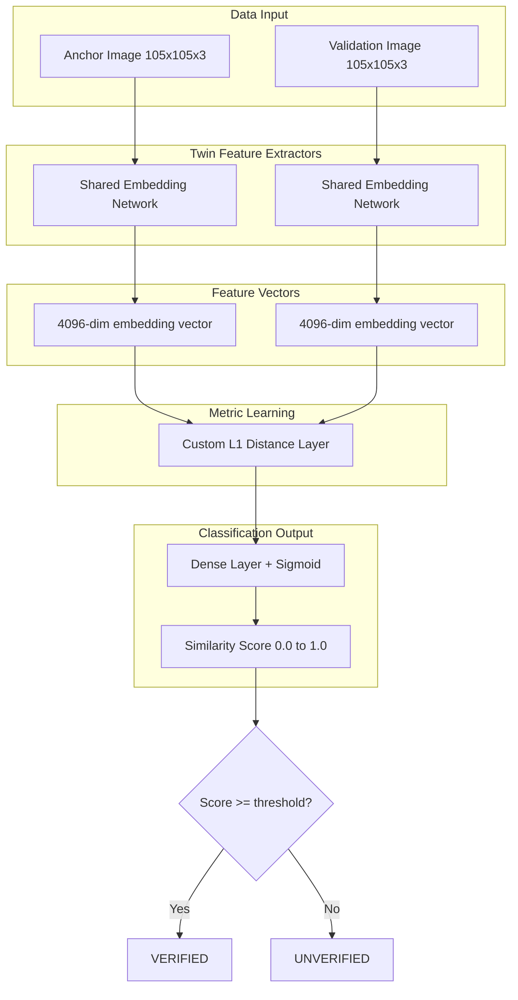
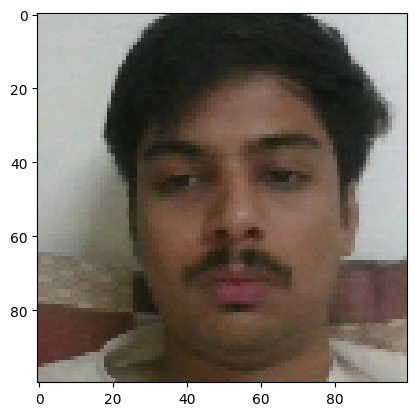
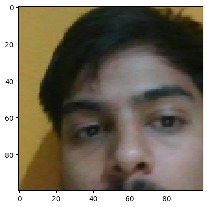
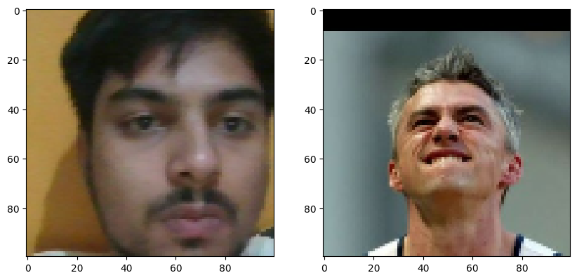
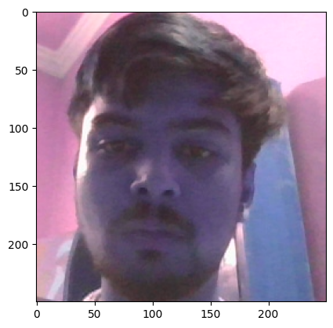
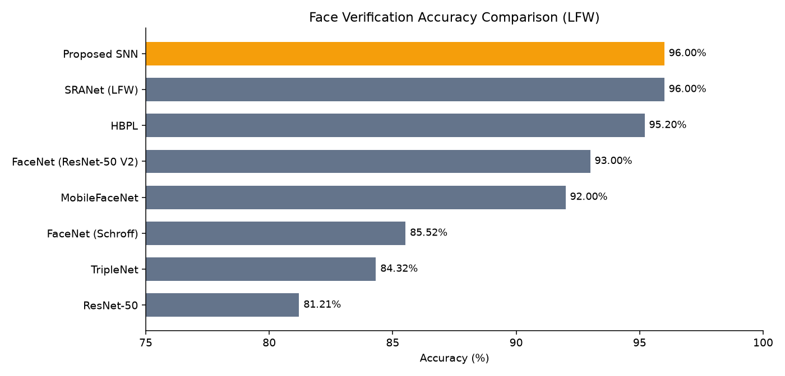

# Real-Time Face Recognition System using Siamese Neural Network

[](RESEARCH_PAPER_Image_Recognition_Using_SNN_Architecture.pdf)
[](https://www.python.org/)
[](https://www.tensorflow.org/)
[](https://opencv.org/)
[](#results--benchmarks)

A one-shot face verification system that learns whether two facial images belong to the same person without requiring a large per-user training set. The project uses a shared-weight CNN Siamese architecture, L1-distance metric learning, and live webcam verification for identity checks.

> Published research: _Real-Time Face Recognition System using Siamese Neural Network for Enhanced Security Applications_  
> Authors: Deepanshu Garhkoti, Sameer Gupta, and Dr. Neha Agarwal

---

## Project Overview

Traditional face recognition systems often fail in low-data and real-world secure environments. This project addresses that with a Siamese Neural Network that compares embedding vectors instead of classifying fixed identities.

### Highlights

- One-shot recognition with a single reference image
- Shared CNN backbone for paired image embeddings
- Custom L1 distance similarity layer
- Real-time verification through webcam input
- 96.00% reported accuracy on benchmark evaluation

---

## System Architecture

The model uses two identical CNN branches with shared weights to extract embedding vectors from two images and compare their distance.



### Core Model Components

1. Embedding network with stacked convolutional layers and max pooling
2. L1 distance layer for similarity measurement
3. Prediction head using sigmoid activation for same-person probability

---

## Results & Benchmarks

| Model / Method                         |  Accuracy  |
| :------------------------------------- | :--------: |
| Proposed Convolutional Siamese Network | **96.00%** |
| SRANet (LFW)                           |   96.00%   |
| HBPL                                   |   95.20%   |
| FaceNet                                |   93.00%   |
| MobileFaceNet                          |   92.00%   |
| TripleNet                              |   84.32%   |
| ResNet-50                              |   81.21%   |

### Result Screenshots

<div align="center">
  
  
  
  
  
</div>

---

## Repository Structure

```text
.
├── RESEARCH_PAPER_Image_Recognition_Using_SNN_Architecture.pdf
├── main.ipynb
├── assets/
│   └── results/
│       ├── anchor_sample.png
│       ├── positive_sample.png
│       ├── verification_pair.png
│       ├── webcam_capture.png
│       └── accuracy_comparison.png
├── application_data/
│   ├── input_image/
│   └── verification_images/
├── data/
│   ├── anchor/
│   ├── positive/
│   └── negative/
├── README.md
└── requirements.txt
```

---

## Quick Start

### Prerequisites

- Python 3.10+
- Webcam-enabled device
- TensorFlow and OpenCV support

### Install dependencies

```bash
pip install tensorflow opencv-python matplotlib numpy pypdf
```

### Run the notebook

```bash
jupyter lab main.ipynb
```

### Workflow

1. Capture anchor and positive samples
2. Train the Siamese model
3. Run the verification pipeline with the webcam
4. Compare similarity scores against stored reference images

---

## Citation

```bibtex
@article{garhkoti2024realtime,
  title={Real-Time Face Recognition System using Siamese Neural Network for Enhanced Security Applications},
  author={Garhkoti, Deepanshu and Gupta, Sameer and Agarwal, Dr. Neha},
  journal={Department of Computer Science, Amity University, Uttar Pradesh},
  year={2024}
}
```

---

## License

This project is distributed for academic and research use. Please review the project files and paper for additional usage terms.
